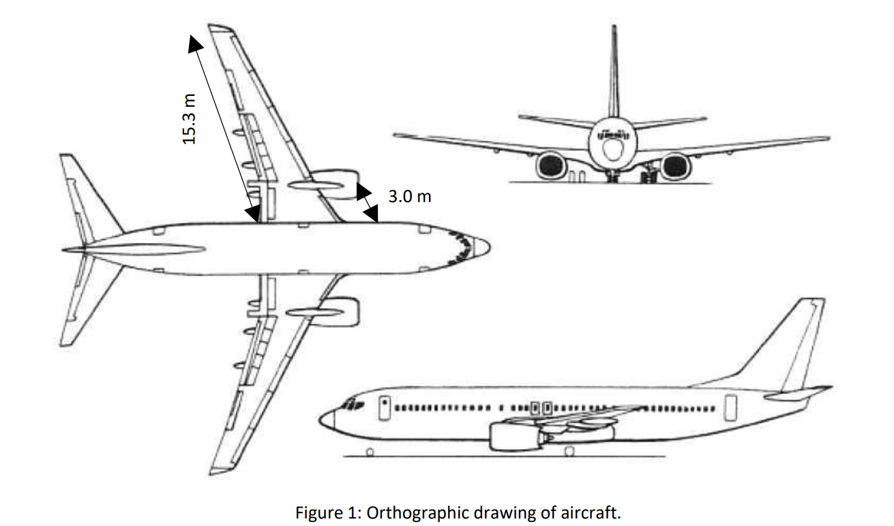
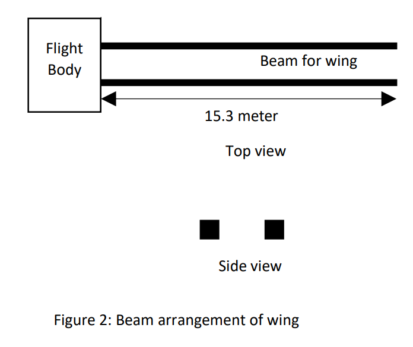
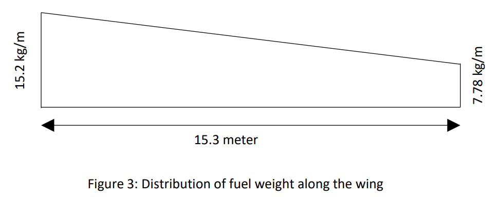
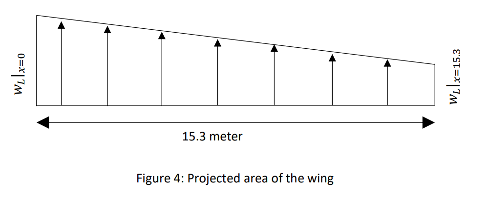
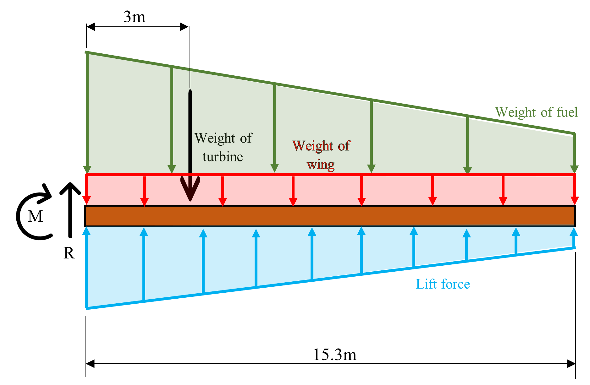

# Macaulays-Method-for-Wing-Structure-Analysis

This MATLAB program solves multiple complex loading conditions on aircraft wing by assuming the wing is made out of two Euler-Bernoulli beams with square cross section.

--- 
## Scenario given
[[Figure 1](#figure1)] show the orthographic drawing of a flight. As a structure engineer, you are requested to estimate the size of supporting beam for the wing. Based on the design, the wing is supported by two square beams as show in Figure 2 and the material for the beam is Carbon – Graphite with the modulus of elasticity 25 GPA.

 
 

Given the dry weight for the Turbine is 1950kg, and the uniform distribution weight for wing is 135 kg/meter. The distribution of fuel weight a along the wing is shown in the [[Figure 3](#figure3)].

 

Let assume the lift force acting on the wing as in [[Figure 4](#figure4)], and then the distribution lift force can be calculated in the equation below.

$$ w_L = - \dfrac{2}{17}\rho x V^2 C_L + 2.55 \rho V^2 C_L  $$

Where,
$\rho$ is density for air 1.225 kg/m3

$V$ is speed (0 km/h to 750 km/h)

$CL$ is lift coefficient depend on attack angle ($CL$ = 0.09 $\alpha$ + 0.4)

$\alpha$ is attack angle (0 deg to 15 deg)

$x$ is the distance from body

 

--- 
## Program's objectives
* a)  To determine the cross section of the beam if the maximum deflection of the wing must not larger than 0.5 meter.
* b) To calculate the location and at what condition happen the maximum transverse stress.
* c) To calculate the location and at what condition happen the maximum bending stress.
* d) To plot the 2D graph maximum shear force verse speed for the angle of attack 0 deg., 10 deg. and 15 deg. in same graph.
* e) To plot the 2D graph maximum bending moment verse speed for the angle of attack 0 deg., 10 deg. and 15 deg. in same graph.
* f) To plot the 2D graph deflection verse speed for the angle of attack 0 deg., 10 deg. and 15 deg. in same graph.
* g) To plot the 3D graph for shear force with the step size for speed 50km/h and step size for angle attack 1 deg.
* h) To plot the 3D graph for bending moment with the step size for speed 50km/h and step size for angle attack 1 deg.
* i) To plot the 3D graph for deflection with the step size for speed 50km/h and step size for angle attack 1 deg.

--- 
## Solution proposed
Before constructing any codes in MATLAB, a correct Macaulay equation is very important for any further calculations. Therefore, we need to first draw a free body diagram of the scenario as shown in [[Figure 5](#figure5)].

 

Given :

- Weight of fuel = 15.2kg/m at x=0 , 7.78kg/m at x=15.3
- Weight of turbine = 1950kg at x=3
- Weight of wing = 135kg/m throughout 
- Lift force = $ -2/17 \rho xv^2 C_L+2.55\rho v^2 C_L $ N/m throughout

Where 
- $\rho$= density of air 1.225 kg/m3 
- $v$ = speed (0-750 km/h)
- $C_L$ = lift coefficient depends on angle of attack ($C_L=0.09\rho+0.4$)
- $\alpha$ = angle of attack (0-15 deg.)
- $x$ = distance from body

By applying $\sum{M_o=0}$ , (clockwise positive)

We get
$$0=M+\frac{\left(135\right)\left(9.81\right)\left(15.3\right)^2}{2}+\left(1950\right)\left(9.81\right)\left(3\right)+\frac{\left(7.78\right)\left(9.81\right)\left(15.3\right)^2}{2}+\frac{\left(7.42\right)\left(9.81\right)\left(15.3\right)^2}{6}-2.55\left(1.225\right)v^2C_L\left(\frac{15.3}{2}\right)\left(15.3\right)-\frac{2}{17}\left(1.225\right)v^2C_L\left(\frac{2}{3}\right)\left({15.3}^2\right)\left(\frac{1}{2}\right) $$

By applying $\sum{F_y=0} $, (upward positive)

We get
$$0=R-\left(135\right)\left(9.81\right)\left(15.3\right)-\left(1950\right)\left(9.81\right)-\left(7.81\right)\left(9.81\right)(15.3)-\frac{1}{2}\left(7.42\right)\left(15.3\right)\left(9.81\right)+2.55\left(1.225\right)v^2C_L\left(15.3\right)-\frac{2}{17}\left(1.225\right)v^2C_L\left({15.3}^2\right)\left(\frac{1}{2}\right)$$

In both the equations above, note that there are two unknowns, the speed of the aircraft(v) and the lift coefficient(C_L). Therefore, when we code in MATLAB, looping is required to evaluate the different reaction forces(R) and moments(M) at the fixed support at different speed and angle of attack and stores the values in the form of 2D array.

After that, Macaulay equation can be constructed according to the free body diagram as shown in [[Figure 6](#figure6)] below :

--- 
## Table of content

